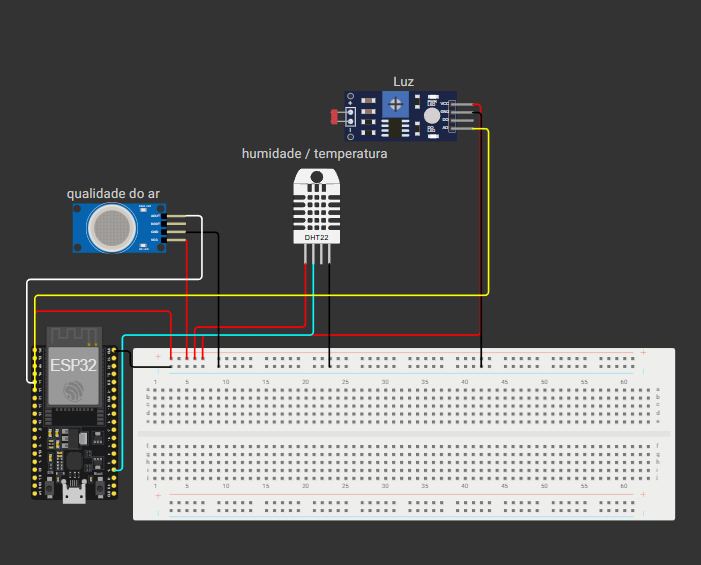

# Sistema Inteligente de Monitoramento de ambiente trabalhista

Este projeto implementa um sistema de monitoramento de ambiente trabalhista baseado em ESP32 com sensores de temperatura, umidade, luminosidade e qualidade do ar.  
A solução foi desenvolvida para o tema **Futuro do Trabalho**, onde ambientes conectados e inteligentes são essenciais para garantir o bem-estar, segurança e produtividade do trabalhador moderno.

O sistema coleta dados em tempo real e envia automaticamente para a plataforma ThingSpeak através de **HTTP Requests**, permitindo a visualização dinâmica dos valores e possibilitando tomadas de decisão mais eficientes.

---

## Equipe

#[- Pedro Marchese – RM 563339](https://github.com/PedroMarchese01)

#[- Jonas Esteves – RM 564143](https://github.com/Augusto-Valerio)  

#[- Augusto Valerio – RM 562185](https://github.com/Augusto-Valerio)

---

# 1. Descrição do Problema

Ambientes de trabalho pouco monitorados podem apresentar:
- Temperaturas inadequadas
- Iluminação insuficiente
- Baixa qualidade do ar
- Umidade fora dos padrões recomendados

Essas condições afetam diretamente:
- Conforto
- Produtividade
- Saúde ocupacional
- Eficiência no ambiente profissional

No contexto do futuro do trabalho, é fundamental que empresas adotem sistemas automatizados capazes de acompanhar e ajustar o ambiente conforme a necessidade do trabalhador.

---

# 2. Descrição da Solução

A solução proposta consiste em um sistema embarcado que:

1. Coleta continuamente dados ambientais.
2. Analisa esses dados localmente no ESP32.
3. Detecta condições inadequadas (calor, frio, ar ruim, baixa luz, etc.).
4. Ativa alertas (por LED) quando necessário.
5. Envia os dados para o ThingSpeak utilizando **HTTP GET**, criando dashboards automáticos.
6. Permite inspeção em tempo real via Serial Monitor.

O circuito é simples, de baixo custo e fácil implementação, podendo ser utilizado em:
- Escritórios inteligentes  
- Indústrias  
- Coworkings  
- Estações de trabalho remotas  

---

# 3. Funcionalidades

- Monitoramento de:
  - Temperatura
  - Humidade
  - Luminosidade
  - Qualidade do ar (MQ-135)
- Avisos no Serial Monitor
- LED de alerta para ar poluído
- Reconexão automática ao Wi-Fi
- Envio contínuo de dados ao ThingSpeak
- Totalmente compatível com simulação via Wokwi

---

# 4. Demonstração do Projeto

## Video no youtube

[**Ver o projeto**](https://youtu.be/7-To5KGpaWI?si=6a2ku_wCqJYkHzjP)

## Simulação no Wokwi

[**Acessar o Projeto no Wokwi**](https://wokwi.com/projects/447467534654824449)

## Dashboard no ThingSpeak

[**Acessar Canal ThingSpeak**](https://thingspeak.mathworks.com/channels/3163643)

---

# 5. Imagens do Circuito




# 6. Dependências

O projeto requer as seguintes bibliotecas:

- WiFi.h  
- HTTPClient.h  
- DHT.h  

Hardware utilizado:
- ESP32 DevKit  
- Sensor DHT11  
- Sensor MQ-135  
- LDR  
- LED  

---

# 7. Instruções de Uso

1. Clone este repositório:  

2. Abra o arquivo principal `.ino` no Arduino IDE.

3. Instale as bibliotecas necessárias.

4. Conecte o ESP32 ao computador.

5. Compile e envie o código.

6. Abra o Monitor Serial para acompanhar as leituras.

7. Para testar sem hardware, utilize o link do Wokwi.

---

# 8. Explicação dos Endpoints HTTP

O envio para o ThingSpeak é feito através do seguinte endpoint: http://api.thingspeak.com/update?api_key=SUA_API_KEY&field1=TEMP&field2=UMIDADE&field3=AR&field4=LUZ

Parâmetros utilizados:

| Campo | Descrição |
|-------|-----------|
| api_key | Chave única do canal ThingSpeak |
| field1 | Temperatura |
| field2 | Umidade |
| field3 | Qualidade do ar |
| field4 | Luminosidade |

Tipo da requisição:  
**GET**

Exemplo utilizado no código:

```cpp
String url = String(server) + "?api_key=" + apiKey +
             "&field1=" + String(temperatura) +
             "&field2=" + String(umidade) +
             "&field3=" + String(qualidadeAr) +
             "&field4=" + String(luz);

http.begin(url);
http.GET();

## 9. Arquivos-Fonte

O repositório deve conter os seguintes arquivos essenciais para o funcionamento completo do projeto:

### 📌 **main.ino**
Arquivo principal do sistema embarcado.  
Contém toda a lógica do ESP32, incluindo:
- Conexão Wi-Fi  
- Leitura de sensores (DHT11, MQ-135, LDR)  
- Envio de dados (MQTT e/ou HTTP)  
- Controle de LEDs  
- Funções auxiliares  
- Estrutura completa e **comentada linha por linha**

### 📌 **Código totalmente comentado**
Todo o código deve explicar claramente:
- O propósito de cada variável  
- Como cada sensor funciona  
- Por que cada etapa do fluxo existe  
- Como os dados são enviados  
- Relação entre o dispositivo e o conceito de **futuro do trabalho**  

Exemplo de estrutura comentada:

```cpp
#include <WiFi.h>
#include <HTTPClient.h>
#include "DHT.h"

// --- PINOS ---
#define DHTPIN 15       // Sensor de temperatura/umidade
#define MQ135_PIN 34    // Qualidade do ar
#define LDR_PIN 35      // Luminosidade
#define LED_PIN 2       // LED indicador

// --- CONFIG DHT ---
#define DHTTYPE DHT11
DHT dht(DHTPIN, DHTTYPE);

// --- WIFI ---
const char* ssid = "Wokwi-GUEST";  
const char* password = "";

// --- THINGSPEAK ---
String apiKey = "M7PW9C6NLUIRKOD7";
String server = "http://api.thingspeak.com/update";

void setup() {
  Serial.begin(115200);

  // Inicializa sensores
  dht.begin();
  pinMode(LED_PIN, OUTPUT);

  // Conecta ao Wi-Fi
  WiFi.begin(ssid, password);
  while (WiFi.status() != WL_CONNECTED) {
    delay(500);
    Serial.println("Conectando ao WiFi...");
  }
  Serial.println("Conectado!");
}

void loop() {
  float temperatura = dht.readTemperature();
  float umidade = dht.readHumidity();
  int qualidadeAr = analogRead(MQ135_PIN);
  int luz = analogRead(LDR_PIN);

  // Exibe dados no Serial Monitor
  Serial.println("Temperatura: " + String(temperatura));
  Serial.println("Umidade: " + String(umidade));
  Serial.println("Qualidade do Ar: " + String(qualidadeAr));
  Serial.println("Luz: " + String(luz));

  // Envio via HTTP
  if (WiFi.status() == WL_CONNECTED) {
    HTTPClient http;
    String url = server + "?api_key=" + apiKey +
                 "&field1=" + temperatura +
                 "&field2=" + umidade +
                 "&field3=" + qualidadeAr +
                 "&field4=" + luz;

    http.begin(url);
    int httpCode = http.GET();
    http.end();
  }

  delay(15000); // padrão ThingSpeak
}
```

## 10. Conclusão

Este projeto demonstra como sistemas embarcados podem contribuir diretamente para o futuro do trabalho, permitindo a criação de ambientes mais inteligentes, seguros e conectados.  
Por meio do monitoramento contínuo de temperatura, umidade, luminosidade e qualidade do ar, é possível garantir condições adequadas para o bem-estar e desempenho do trabalhador.

A integração entre sensores, conectividade Wi-Fi e plataformas em nuvem (como o ThingSpeak) torna possível:

- Acompanhamento em tempo real das variáveis ambientais  
- Adoção de ações preventivas e corretivas no ambiente de trabalho  
- Redução de riscos e melhoria da qualidade de vida  
- Automatização de processos de controle ambiental  
- Suporte a decisões baseadas em dados  
- Criação de espaços inteligentes alinhados às novas demandas do futuro do trabalho  

Assim, este sistema evidencia como soluções IoT podem transformar o ambiente corporativo, promovendo eficiência, segurança e inovação.